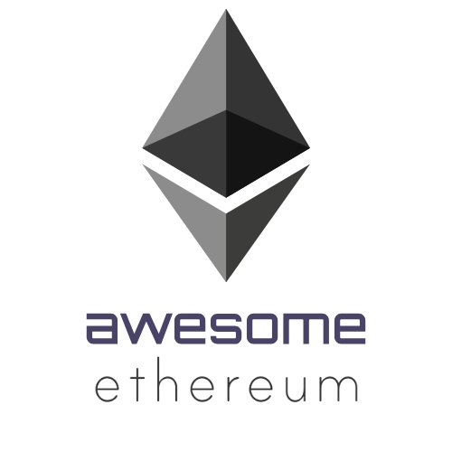

 

  

 

An awesome list about everything related to the Ethereum platform.
 

 

Pull requests are welcome! In the spirit of decentralized applications however, please ensure your submission is not a paywalled product.

Inspired by [Awesome Python](https://github.com/vinta/awesome-python) and [Awesome Machine Learning](https://github.com/josephmisiti/awesome-machine-learning)

## Contents

1. [Documentation](#documentation)
2. [Programming](#programming)
3. [Tutorials](#tutorials)
4. [Code](#code)
5. [Learning and MOOCs](#learning-and-moocs)
6. [Philosophy](#philosophy)
7. [Videos](#videos)
8. [Wallets](#wallets)
9. [Blockchain Utilities](#blockchain-utilities)
10. [Protocols](#protocols)
11. [Books](#books)
12. [Misc](#misc)
13. [Official](#official)

## Documentation

Official Ethereum Documentation.

- [Ethereum Github Wiki](https://github.com/ethereum/wiki/wiki) - Ethereum wiki covering all things related to Ethereum. The go-to place for all things.
- [Ethereum Whitepaper](https://github.com/ethereum/wiki/wiki/White-Paper) - Non-technical introductory description of Ethereum.
- [Ethereum Yellowpaper](https://ethereum.github.io/yellowpaper/paper.pdf) - Technical description of Ethereum. Technically outdated, but interesting.

## Programming

 - [OpenZeppelin](https://openzeppelin.org/) - battle-tested framework of secure, reusable smart contracts.
 - [Truffle Framework](https://www.truffleframework.com/) - development environment for blockchain applications.
 - [Ganache](https://truffleframework.com/ganache) - personal Ethereum blockchain to run tests.
 - [Remix Online IDE](https://remix.ethereum.org/) - A useful in-browser IDE that can compile and publish smart contracts to various Ethereum networks. Includes a linter.
 - [Embark Framework](https://github.com/embark-framework/embark) - Framework for serverless Decentralized Applications using Ethereum, IPFS and other platforms.

## Tutorials

Step by step guides on using Ethereum.

- [CryptoZombies](https://cryptozombies.io/) - Learn to Code Ethereum DApps By Building Your Own Game.
- [Hitchhikers Guide to Smart Contracts](https://blog.zeppelin.solutions/the-hitchhikers-guide-to-smart-contracts-in-ethereum-848f08001f05) - Build smart contracts on Ethereum using Truffle, testrpc and Solidity.
- [A 101 Noob Intro to Programming Smart Contracts on Ethereum](https://medium.com/@ConsenSys/a-101-noob-intro-to-programming-smart-contracts-on-ethereum-695d15c1dab4) - Smart contract tutorial with a focus on building up understanding before code.
- [Parity DApp Tutorial](https://wiki.parity.io/Dapp-Tutorial) - 10 part tutorial on how to write DApps.
- [Start Ethereum DApp Development Career](https://www.reddit.com/r/ethereum/comments/9h0w83/start_ethereum_dapp_development_career_ultimate/) - Informal guide to starting developing DApps.
- [Full Stack DApp Tutorial Series](https://beta.kauri.io/collection/5b8e401ee727370001c942e3/full-stack-dapp-tutorial-series) - Full stack DApps using various frameworks.
- [Ethereum Builders Guide](https://ethereumbuilders.gitbooks.io/guide/content/en/index.html) - Gitbook for building on Ethereum that goes deeper into understanding technical functionality.
- [Learning Solidity Tutorial Series](https://karl.tech/learning-solidity-part-1-deploy-a-contract/) - Building smart contracts with Metamask and Remix IDE.
- [End to End DApp Tutorial](https://medium.com/@merunasgrincalaitis/the-ultimate-end-to-end-tutorial-to-create-and-deploy-a-fully-descentralized-dapp-in-ethereum-18f0cf6d7e0e) - Create a gambling DApp using Metamask, Truffle, Remix, React and IPFS.
- [Various Ethereum & Solidity Tutorials](https://www.codementor.io/learn/blockchain/solidity-tutorials) - How to create smart contracts, deploy your own DApps, create tokens, and more — from beginner to intermediate topics.

## Code

- [Solidity Documentation](https://solidity.readthedocs.io) - Programming language of choice for smart contracts.
- [Vyper Documentation](https://vyper.readthedocs.io/en/latest/index.html) - Experimental smart contract programming language intended to replace Solidity.

## Learning and MOOCs

Learn about the theory behind Ethereum.

- [Ethereum Stack Exchange](https://ethereum.meta.stackexchange.com/questions/431/faq-frequently-asked-questions-and-reference-answers) - Question and answers about Ethereum.
- [Smart contract safety](https://github.com/ethereum/wiki/wiki/Safety) - Ethereum wiki on best practices for safety in smart contracts.
- [Accounts, Transactions, Gas, and Block Gas Limits in Ethereum](https://hudsonjameson.com/2017-06-27-accounts-transactions-gas-ethereum/) - Functional description of Ethereum accounts, gas and transactions.
- [Ethernaut Smart Contract Capture the Flag](https://ethernaut.zeppelin.solutions/) - Practice hacking Smart Contracts.
- [Ethereum Syllabus](https://novicedock.com/learn/cryptocurrency/ethereum) - Syllabus to learn Ethereum.
- [Cryptocurrency Security: University of Illinois 2016](http://soc1024.ece.illinois.edu/teaching/ece598am/fall2016/) - Cryptocurrency Security Course.
- [Stanford CS 251(p): Bitcoin and Crypto Currencies](https://crypto.stanford.edu/cs251_fall15/) - Stanford Bitcoin and Cryptocurrency Course.
- [Introduction to Digital Currencies: University of Nicosia](https://digitalcurrency.unic.ac.cy/free-introductory-mooc/) - Digital currency introductory MOOC.
- [Bitcoin and Blockchain Technology: Concordia University](https://users.encs.concordia.ca/~clark/courses/1703-6630/index.html) - Introduction to Bitcoin and blockchain technology MOOC.
- [Smart Contract Best Practices](https://consensys.github.io/smart-contract-best-practices/) - Security related best practices for smart contracts.
- [Low-Resource Eclipse Attacks on Ethereum’s Peer-to-Peer Network](https://www.cs.bu.edu/~goldbe/projects/eclipseEth.pdf)

## Philosophy

The Ideas behind the Ethereum Project.

- [Making Smart Contracts Smarter](https://eprint.iacr.org/2016/633.pdf) - Smart contract security attacks.
- [Ethereum Wiki Philosophy](https://github.com/ethereum/ethereum.org/wiki/Philosophy) - Some of the core philosophies of Ethereum.
- [Ethereum Improvement Proposals](https://eips.ethereum.org/) - Standards for the Ethereum platform, including core protocol specifications, client APIs, and contract standards.

## Videos

- [Ethereum Explained (22:00)](https://www.youtube.com/watch?v=-_Qs0XdPpw8) - Introductory explanation to the Ethereum platform.
- [A Guide to Building Your First Decentralized Application (37:00)](https://www.youtube.com/watch?v=gSQXq2_j-mw)
- [Ethereum Youtube Channel](https://www.youtube.com/user/ethereumproject) - Mostly older videos of Devcon 1 and before.
- [Ethereum Foundation Youtube Channel](https://www.youtube.com/channel/UCNOfzGXD_C9YMYmnefmPH0g) - Most up to date events and streams including the Ethereum Devcon conferences and dev meetings.

## Wallets

- [MetaMask](https://metamask.io/) - Browser extension that can interact with Remix IDE and send transactions to different testnets.
- [MyEtherWallet](https://www.myetherwallet.com/) - Online wallet service that interacts with the blockchain and performs several other useful functions.
- [Mist](https://github.com/ethereum/mist) - Official Ethereum wallet - Browse and use Ðapps on the Ethereum network.
- [MyCrypto](https://www.mycrypto.com) - Online wallet service that interacts with the blockchain and performs several other useful functions.

## Blockchain Utilities

- [ETH Gas Station](https://ethgasstation.info/) - a tool to check the current price of gas for transactions.
- [Etherscan](https://etherscan.io/) - Ethereum block explorer with other useful block utilities.
- [Ethplorer](https://ethplorer.io/) - Ethereum block explorer.
- [Etherchain](https://www.etherchain.org/) - Ethereum block explorer.

## Protocols
- [Swarm](http://swarm-gateways.net/bzz:/theswarm.eth/) - Swarm is a distributed storage platform and content distribution service.
- [Whisper](https://github.com/ethereum/wiki/wiki/Whisper-pages) - a communication protocol for DApps to communicate with each other.
- [Casper](https://github.com/ethereum/wiki/wiki/Casper-Proof-of-Stake-compendium) - Proof of Stake Implementation.
- [Sharding](https://github.com/ethereum/wiki/wiki/Sharding-introduction-R&D-compendium) - Partitioning computational resources so that node do not have to process the entire blockchain.
- [Web3.js](https://github.com/ethereum/web3.js) - Ethereum's javascript API.
- [Ethash Proof of Work](https://github.com/ethereum/wiki/wiki/Ethash) - Ethereum's Proof of Work Algorithm.

## Books
- [Mastering Ethereum](https://github.com/ethereumbook/ethereumbook) - A developers guide to the operation and use of Ethereum
- [Introduction to Ethereum and Solidity](https://the-eye.eu/public/Books/qt.vidyagam.es/library/humble-bitcoin-bundle/Introducing%20Ethereum%20and%20Solidity_%20Foud%20Blockchain%20Programming%20for%20Beginners/Introducing%20Ethereum%20and%20Solidity_%20Foundatiin%20Programming%20for%20Beginners%20-%20Chris%20Dannen.pdf) - Learn Solidity development from concept to deployment
- [Ethereum: Blockchains, Digital Assets, Smart Contracts, Decentralized Autonomous Organizations](https://www.goodreads.com/book/show/32762240-ethereum) - Learn about Ethereum (and blockchains) from an IBM blockchain liason

## Misc

- [r/Ethereum](https://www.reddit.com/r/ethereum/) - Ethereum subreddit.
- [State of the DApps](https://www.stateofthedapps.com/) - A comprehensive list of the Decentralized Applications (DApps) on Ethereum.
- [ETH Gas Station](https://ethgasstation.info/) - a tool to check the current price of gas for transactions.
- [Week in Ethereum](http://www.weekinethereum.com/) - A summary of everything happening in Ethereum each week.
- [Ethereum Worldwide Meetups](https://www.meetup.com/find/?allMeetups=false&keywords=ethereum) - Meet up with the local Ethereum community via meetup.com.
- [Ethereum Wiki Page](https://theethereum.wiki/w/index.php/Main_Page)

## Official

- [Ethereum Website](https://www.ethereum.org/)
- [Ethereum Foundation](https://ethereum.org/foundation)
- [Ethereum Github](https://github.com/ethereum/)

# Contribute

Contributions welcome! Read the [contribution guidelines](contributing.md) first.

## License

To the extent possible under law, @Tom2718 has waived all copyright and
related or neighboring rights to this work.
